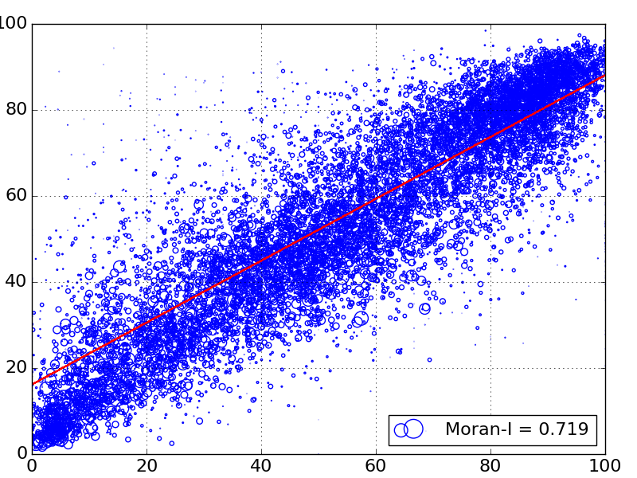

Example of embedding python in an RMarkdown document and running

```{r, engine='python', engine.path='C:/Users/mbeck/AppData/Local/Continuum/Anaconda2/python.exe'}
import pysal
import numpy as np
import matplotlib.pyplot as plt
def moran_scatterplot():
    # Construct weights
    w = pysal.queen_from_shapefile('ky_licking.shp')
    f = pysal.open('ky_licking.dbf')

    col_name = 'PctDecid20'
    y = np.array(f.by_col[col_name])    
    s =  np.array(f.by_col['AreaSqKM'])
    s = np.multiply(s,5)

    # Normalize weights
    w.transform = 'r'
    gal = pysal.open('weights.gal','w')
    gal.write(w)
    gal.close()
    
    yl = pysal.lag_spatial(w,y)
    mi = pysal.Moran(y, w, two_tailed=False)

    m, b = np.polyfit(y, yl, 1)
    plt.scatter(y, yl, s=s, facecolors='none', edgecolors='b', label='Moran-I = ' + str('%.3f'%mi.I))
    plt.plot(y, m*y+b, '-', color='red', linewidth=1)
    xmin,xmax,ymin,ymax = plt.axis()
    plt.axis((0,100,0,100))
    plt.ylabel(col_name + ' (spatially lagged)', fontsize=16)
    plt.xlabel(col_name, fontsize=16)
    plt.tick_params(axis='both', which='major', labelsize=16)
    plt.grid(True)
    plt.legend(loc=4, fontsize=16)
    plt.subplots_adjust(bottom=0.05, right=0.95, top=0.95, left=0.05)
    plt.savefig('contiguity.png')
    
moran_scatterplot()
```

Moran Scatterplot:




